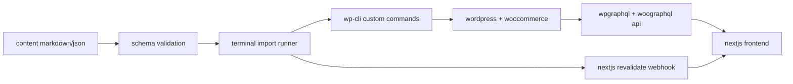
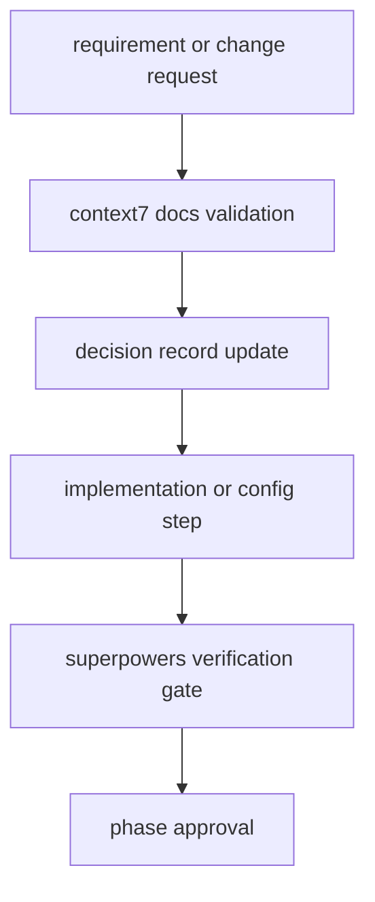

# Headless WooCommerce + Terminal-First Operations Plan

## 1) Goals and Scope

- Goal: run WooCommerce in a headless architecture, transform `stitch` outputs into a production frontend, and operate catalog/page/policy/static content primarily from terminal workflows.
- Principle: keep WordPress Admin usage minimal in day-to-day operations; automate content, configuration, and release workflows.
- Current assets: static prototype HTML and design-system docs exist in `stitch` (e.g. `stitch/kinetic_precision/DESIGN.md`, `stitch/precision_cnc_homepage/code.html`, `stitch/cnc_parts_category_listing/code.html`).

## 2) Architecture Decisions (Default Baseline)

- Backend CMS/Commerce: WordPress + WooCommerce.
- GraphQL layer: `WPGraphQL` + `WPGraphQL for WooCommerce` (required).
- Frontend: Next.js (App Router) + GraphQL client (Apollo or urql).
- Content source of truth: markdown/json files in Git.
- Operations backbone: `WP-CLI` as primary CLI; Woo-specific tasks via WP-CLI commands/scripts.
- Checkout default: Phase 1 uses native Woo checkout (fast, lower risk); fully headless checkout is optional in Phase 2.
- Auth default: no auth in Phase 1 for public catalog; introduce JWT/headless login when account/order flows are required.

## 3) End-to-End System Flow

## 3.1) Process Governance (Context7 + Superpowers)

- Context7 role (documentation gate):
  - Validate official, up-to-date docs before decisions involving WPGraphQL, WooGraphQL, JWT/headless login, Next.js cache/revalidate behavior, WP-CLI, and related plugins.
  - No assumption-based decisions; all critical behavior must be doc-verified.
  - Maintain decision records for version-sensitive behavior (version, expected behavior, known constraints).
- Superpowers role (quality gate):
  - `writing-plans`: lock scope and acceptance criteria before each phase.
  - `test-driven-development`: use test/fixture-first for content pipeline, GraphQL contracts, and critical adapters.
  - `systematic-debugging`: require root-cause analysis for API/auth/cache issues.
  - `verification-before-completion`: no phase completion without evidence (test output/command output).
  - `requesting-code-review`: mandatory review checkpoint after major phase completion.

## 3.2) Documentation and Verification Workflow

## 3.3) Mandatory Plugin Integration Plan (Context7 + Superpowers)

### 3.3.1 Context7 Integration (Documentation Authority)

- Objective:
  - Use Context7 as the single documentation authority for all library/framework/plugin behavior that may affect implementation decisions.
- Scope (mandatory):
  - WordPress plugins: WPGraphQL, WPGraphQL for WooCommerce, JWT/headless auth plugins, ACF GraphQL extensions.
  - Frontend stack: Next.js App Router, caching/ISR/revalidation mechanics, GraphQL client behavior.
  - Operations stack: WP-CLI command behavior, option/schema compatibility, upgrade/migration notes.
- Required workflow:
  1. Before implementation starts for any phase item, query Context7 for the exact feature/API used.
  2. Extract version-specific guidance (supported versions, deprecations, known caveats).
  3. Record the decision in a decision log entry (tool/library, version, chosen pattern, rejected alternatives).
  4. If docs and existing code assumptions conflict, Context7 result takes precedence and plan is updated.
- Enforcement:
  - Any task without Context7-backed decision evidence is blocked from “done” status.
  - Breaking-change sensitive actions (auth, revalidation, schema mapping) require explicit Context7 citation in task notes.
- Deliverables:
  - `docs/decisions/` style decision records (or equivalent) for all high-impact technical choices.
  - A “doc verified” tag/check in phase completion checklist.

### 3.3.2 Superpowers Integration (Execution Quality System)

- Objective:
  - Use Superpowers skills as mandatory process controls, not optional guidance.
- Skills and mandatory trigger points:
  - `using-superpowers`: run at kickoff of execution session.
  - `writing-plans`: run before touching implementation scope in each phase.
  - `test-driven-development`: run before feature/bugfix implementation in pipeline/data/auth layers.
  - `systematic-debugging`: run for any failure in API, auth, cache, import, revalidate, deployment.
  - `verification-before-completion`: run before claiming any phase complete.
  - `requesting-code-review`: run after major phase completion before merge/release.
- Enforcement:
  - Exactly one phase can be “in progress”; phase handoff requires verification output artifacts.
  - No “works on my machine” completion claim without test output and verification trace.
  - Bugfixes merged without systematic-debugging evidence are considered incomplete.
- Deliverables:
  - Phase-level verification bundle (test output, command output, brief RCA summary where applicable).
  - Review checkpoint log for each major phase.

### 3.3.3 Combined Gate Matrix (Operational Rules)

- Gate A: Documentation Gate (Context7)
  - Must pass before implementation decisions are finalized.
- Gate B: Implementation Gate (Superpowers TDD/Debugging)
  - Must pass before phase-level coding tasks can be closed.
- Gate C: Completion Gate (Superpowers Verification + Review)
  - Must pass before phase sign-off and rollout.
- Failure policy:
  - If any gate fails, rollback to previous gate, update plan/task notes, and re-run checks.

### 3.3.4 Acceptance Criteria for Plugin Integration

- Context7 is used in every phase for version-sensitive decisions.
- Superpowers checkpoints are visible in each phase close-out.
- At least one auditable artifact exists per gate per phase.
- No phase is marked complete without Gate A + Gate B + Gate C evidence.

## 4) WordPress Foundation Setup

- Core plugins:
  - WooCommerce
  - WPGraphQL
  - WPGraphQL for WooCommerce
- Optional plugins (requirement-driven):
  - JWT-based auth plugin (if headless account/login is needed)
  - ACF + WPGraphQL ACF (if custom fields are required)
- Site settings:
  - Permalink: post-name
  - CORS: allow frontend domain(s)
  - Security headers and API access policies
- Documentation gate:
  - Verify plugin setup instructions and compatibility notes via Context7 before finalizing setup decisions.
- Data model:
  - Products, categories, tags, attributes, variations, stock, pricing, images
  - Static pages/policies/settings via page/options model

## 5) Frontend Plan (Stitch to Production UI)

- Source assets to convert:
  - `stitch/precision_cnc_homepage/code.html`
  - `stitch/cnc_parts_category_listing/code.html`
  - other screens under `stitch/*/code.html`
- Componentization:
  - `Header`, `Footer`, `Hero`, `CategoryGrid`, `ProductCard`, `FilterSidebar`, `PolicyPageSection`
- Design-system migration:
  - Move token definitions from `DESIGN.md` into Tailwind config + CSS variables.
- Route contract:
  - `/` homepage
  - `/category/[slug]`
  - `/product/[slug]`
  - `/page/[slug]` (about/contact, etc.)
  - `/policy/[slug]` (privacy/terms/kvkk, etc.)
- Rendering strategy:
  - ISR for catalog/static pages
  - SSR or short revalidate windows for stock/price-sensitive views
- Documentation gate:
  - Confirm Next.js data-fetching and revalidation behavior with Context7 per version.

## 6) Terminal-First Content Operations (Core Requirement)

- Repository content contract:
  - `content/pages/*.md` (about, contact, etc.)
  - `content/policies/*.md` (privacy, terms, kvkk, etc.)
  - `content/settings/site.json` (phone, email, footer, address, fixed copy)
  - `content/schemas/*.json` (schema definitions for validation)
- File format:
  - Markdown + frontmatter (`slug`, `title`, `status`, `template`, `seo`)
- Target automation commands:
  - `wp content import content/pages/about.md`
  - `wp content import-dir content/pages`
  - `wp policy set privacy content/policies/privacy.md`
  - `wp settings sync content/settings/site.json`
- LLM-assisted content workflow:
  1. Provide a terminal prompt (e.g., generate/update policy text).
  2. LLM creates/updates target markdown/json files.
  3. Run schema validation.
  4. Run WP-CLI import/sync command.
  5. Trigger Next.js revalidation.
- Process gate:
  - Pipeline changes require fixture-based tests before phase sign-off.

## 7) WP Admin Minimization Strategy

- Daily content operations run via repo + terminal only.
- WP Admin is reserved for exceptions:
  - plugin update/compatibility incidents
  - rare manual verification
  - emergency production interventions
- User/role/ops procedures are scripted in terminal workflows.

## 8) Auth and Account Decision Gate

- Phase 1 (default):
  - Public catalog + product/category/page routes are headless
  - Checkout stays native Woo
  - No JWT
- Phase 2 (if required):
  - Headless login/register
  - My Account, order history, address management
  - JWT/headless-login plugin + token lifecycle + security controls
- Decision criterion:
  - Move to Phase 2 only when headless account experiences are mandatory on frontend.
- Documentation and security gate:
  - Do not finalize JWT/headless-login plugin choice without Context7 verification of maintenance status, compatibility, and security notes.

## 9) Deployment and Environment Management

- Environments: local / staging / production.
- Deployment model:
  - WordPress and frontend deployed independently.
  - Isolate environment variables (API URL, auth secrets, webhook URL).
- Revalidation:
  - Trigger route-targeted revalidation after content import.
- Backup:
  - Scheduled DB exports + media sync strategy.

## 10) Testing and Verification Plan

- API verification:
  - Product/category/page queries return expected fields and shapes.
- UI verification:
  - Maintain visual fidelity to Stitch outputs (typography, spacing, color tokens).
- Content-pipeline verification:
  - md/json change -> validate -> import -> GraphQL availability -> frontend visibility.
- Operations verification:
  - Single-command policy update and publish flow works end-to-end.
- Performance:
  - Measure LCP/TTFB for homepage/category/product pages and tune ISR windows.
- Superpowers phase gates:
  - Scope conformance (`writing-plans`)
  - Root-cause records (`systematic-debugging`)
  - Completion evidence (`verification-before-completion`)
  - Major-phase review (`requesting-code-review`)

## 11) Risks and Mitigations

- Plugin compatibility risk:
  - version pinning + mandatory staging validation.
- Auth security risk:
  - JWT only when needed; short-lived tokens + refresh strategy.
- Content consistency risk:
  - schema validation + CI enforcement.
- Editorial error risk:
  - draft/publish workflow + terminal preview checks.

## 12) Phased Delivery Timeline

- Phase 0: Foundation setup (WordPress + Woo + GraphQL plugins + CORS/permalink) + plugin integration bootstrap (`using-superpowers` + Context7 baseline validation).
- Phase 1: Stitch homepage/category/product componentization + live data integration + Context7-backed Next.js data/revalidate decisions.
- Phase 2: Terminal-first content pipeline (md/json + validate + wp-cli import + revalidate) + mandatory TDD/debugging gates.
- Phase 3: Ops automation (seed, backup, deploy scripts, role/permission commands) + verification-before-completion + code-review checkpoints.
- Phase 4 (optional): Full headless auth/account flow + JWT security verification + strict Context7 compatibility validation.

## 13) Success Criteria (Definition of Done)

- Categories, products, static pages, and policies are live on frontend via GraphQL.
- Static copy (about/contact/policies) is publishable via terminal + files + commands, without opening WP Admin.
- Content updates run in one automated path: generate/edit -> validate -> import -> revalidate.
- Most WooCommerce operational tasks are handled via scripted terminal workflows.
- WP Admin is used only for exceptional maintenance.
- Critical technical decisions are documented and verified through Context7.
- Phase transitions pass Superpowers quality gates with explicit evidence.
- Context7 and Superpowers are operationally integrated as hard gates, not advisory notes.
- Each phase has auditable gate artifacts (doc evidence, verification outputs, review checkpoint).
